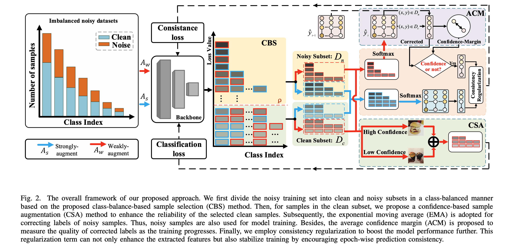

# Learning with Imbalanced Noisy Data by Preventing Bias in Sample Selection
**Abstract:** —Learning with noisy labels has gained increasing attention because imperfect labels are inevitable in real-world scenarios and substantially hurt the deep model performance. Recent studies tend to regard low-loss samples as clean ones and discard high-loss ones to alleviate the negative impact of noisy labels. However, real-world datasets contain not only noisy labels but also class imbalance. The imbalance issue is prone to causing failure in the loss-based sample selection since the under-learning of tail classes also leans to produce high losses. To this end, we propose a simple yet effective method to address noisy labels in imbalanced datasets. Specifically, we propose Class-Balance-based sample Selection (CBS) to prevent the tail class samples from being neglected in the training process. We propose Confidence-based Sample Augmentation (CSA) for the chosen clean samples to enhance their reliability in the training process. Besides, we employ Consistency Regularization (CR), which is designed to encourage sample-view-wise and epoch-wise prediction consistency to maximize data exploitation and boost model performance further. Lastly, we further introduce the Confidence-Margin (CM) metric to measure the quality of corrected labels by leveraging the model’s evolving training dynamics, thereby ensuring that low-quality corrected samples are appropriately masked out. Comprehensive experimental results on synthetic and real-world datasets demonstrate the effectiveness and superiority of our proposed method, especially on imbalanced datasets.

# Pipeline



# Installation
```
pip install -r requirements.txt
```

# Datasets
Currently three datasets are supported: CIFAR10, CIFAR100 and Clothing1M
Synthetic datasets are mainly derived from CIFAR10 and CIFAR100. 
To further verify the feasibility and effectiveness of our method in practical scenarios, we conduct experiments on a real-world dataset (\ie, Clothing1M)

You can download the CIFAR10 and CIFAR100 on [this](https://www.cs.toronto.edu/~kriz/cifar.html).

You can download the Clothing1M from [here](https://github.com/lightas/Occluded-DukeMTMC-Dataset).

# Training

Here is an example shell script to run CBS on CIFAR-10 :

```python
python main_v6.py  --closeset-ratio 0.6 --rho-range 0.8:0.7:100 --dataset cifar10 --imb-factor 0.02 --gpu 0
```

Here is an example shell script to run CBS on CIFAR-100 :

```python
python main_v6.py --closeset-ratio 0.6 --rho-range 0.8:0.7:100 --dataset cifar100 --imb-factor 0.02 --gpu 0
```

Here is an example shell script to run CBS on CIFAR-100 :

```python
 python main_web.py --rho-range 0.9:0.8:30 --dataset web-bird --gpu 0
```

# Results on Cifar10.
!(Table1.png)
# Results on Cifar100.
!(Table2.png)
# Results on Web-Aircraft, Web-Bird, and Web-Car.
!(Table3.png)
